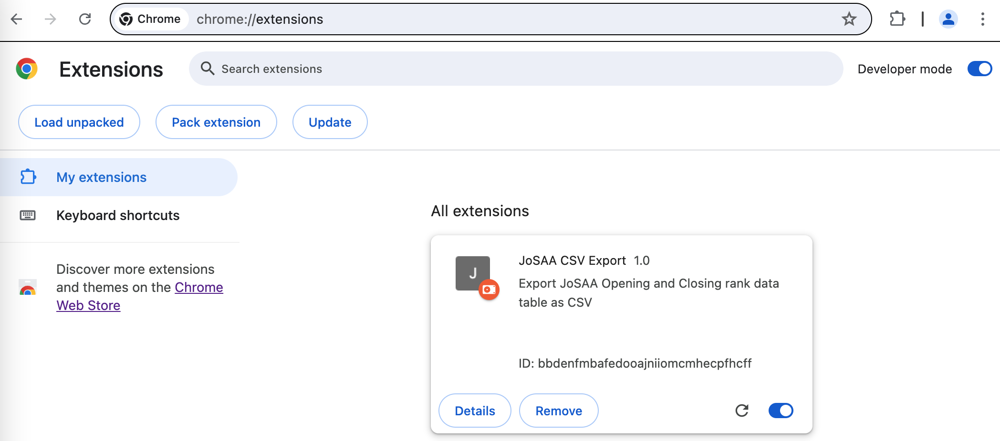
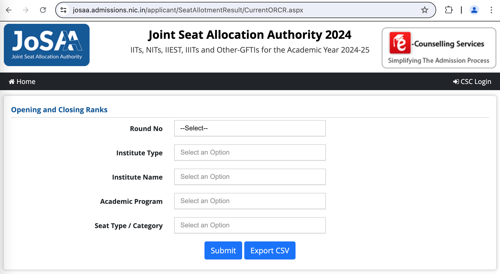
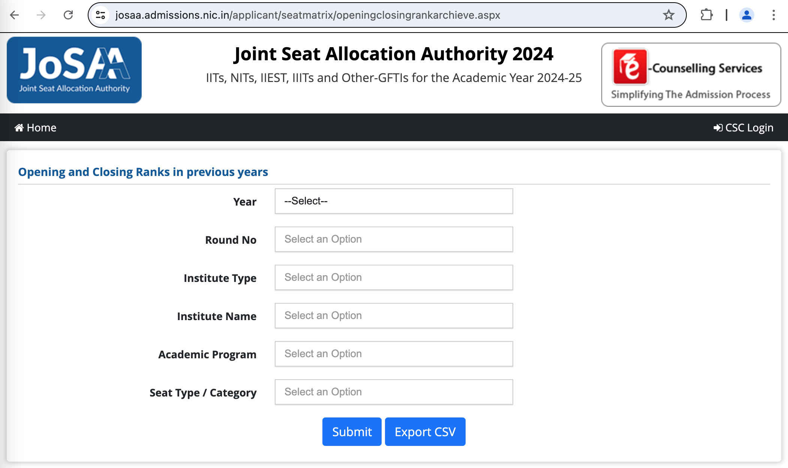
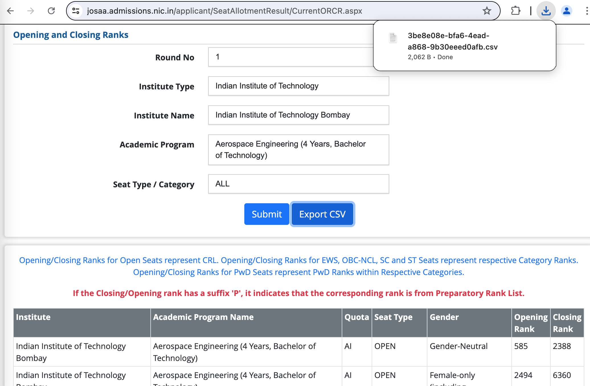
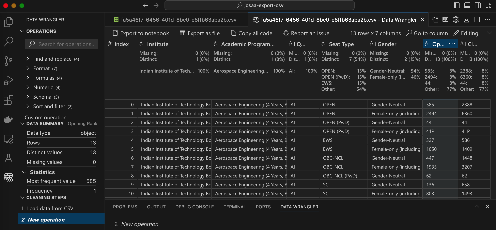

# JoSAA Export CSV

This is a **Chrome Browser Extension** that allows exporting JoSAA Opening and Closing Rank [data](https://josaa.nic.in/or-cr/) tables as CSV files.

## Installation

- Clone this repository
- Open Chrome extenions page by typing `chrome://extensions/`
- Enable `Developer Mode` on the top right
- Click on `Load unpacked` button and select the `josaa-export-csv` folder where you cloned this repository

You should see something like this:

## Usage

- Visit the JoSAA Opening and Closing Ranks [page](https://josaa.nic.in/or-cr/)
    - Current Year Opening and Closing Ranks
        - https://josaa.admissions.nic.in/applicant/SeatAllotmentResult/CurrentORCR.aspx
    - Previous Years Opening and Closing Ranks
        - https://josaa.admissions.nic.in/applicant/seatmatrix/openingclosingrankarchieve.aspx
- With the extension enabled, you should see a `Export CSV` button right next to the `Submit` button on these pages as shown here:

- Search as you would normally do and then click on the `Export CSV` button.  A CSV file of the table data will be downloaded as shown here:

- You can use the downloaded CSV file in your favorite analysis tool, Excel, Google Sheets, scripts or code

